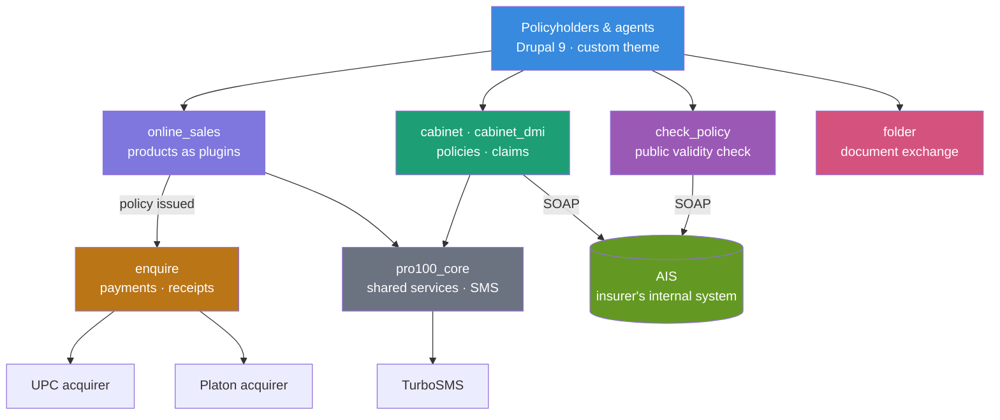

# 🛡 PRO100 — Insurance Platform (Drupal 9)

> An online platform for a Ukrainian insurance company: selling policies over the web,
> taking card payments, and giving policyholders a cabinet where they can see their
> contracts and track claims against them.

> ℹ️ **Portfolio showcase.** This repository describes the architecture and selected
> engineering of a private commercial project. The source code belongs to the client and is
> **not published here** — the snippets below are rewritten and trimmed for illustration.
> The company ceased operations in 2023 and the site is offline.

---

## What is this?

Insurance is a domain where the interesting work is rarely the website. A policy has to be
priced from a tariff table, sold, paid for, printed, registered in the insurer's internal
system, and then — sometimes years later — claimed against. Those steps live in different
systems, and the platform's job is to hold them together.

PRO100 is a **Drupal 9** platform of eight custom modules covering that chain: an online
sales engine where each insurance product is a plugin, two card acquirers, PDF receipts and
policies, a policyholder cabinet talking to the insurer's internal system over SOAP, a claims
tracker, and a document exchange for claim paperwork.

My role: **backend and architecture** — all modules described below.

**Scale of the custom code:** 8 modules · ~21,400 lines of PHP · in production 2020–2023 ·
1,000–2,000 payments processed per day at its peak.

---

## Architecture



---

## Tech Stack


---

## Modules

| Module | Responsibility |
|---|---|
| `online_sales` | Sales engine — each insurance product is a discoverable plugin |
| `enquire` | Card payments through two acquirers, PDF receipts, accounting export |
| `cabinet` / `cabinet_dmi` | Policyholder cabinet: contracts and claims, general and health insurance |
| `check_policy` | Public check that a policy number is valid and in force |
| `folder` | Document exchange for claim paperwork, with expiring links |
| `pro100_core` | Shared services, SMS gateway, common integration code |
| `pro100_theme` | Front end |

---

## Engineering highlights

### 🧩 Insurance products as plugins

A travel policy and a COVID policy share almost nothing: different questions, different
tariffs, different blank series, different printed forms. What they share is a lifecycle —
quote, order, pay, print, register. So the lifecycle lives in the engine and each product is
a plugin discovered through Drupal's own plugin system:

```php
class OnlineSalesPluginManager extends DefaultPluginManager
{
    public function __construct(\Traversable $namespaces, CacheBackendInterface $cache, ModuleHandlerInterface $modules)
    {
        parent::__construct('Plugin/Products', $namespaces, $modules);
        $this->alterInfo('online_sales_products_info');   // other modules may extend the catalogue
        $this->setCacheBackend($cache, 'online_sales_plugins');
    }
}
```

Every product implements the same small contract — entry point, display names, blank series,
its configuration — so the engine can list, route and render products it knows nothing about:

```php
abstract class BaseProduct extends PluginBase
{
    abstract public function start(): array;              // entry point for the sales flow
    abstract public static function getShortName(): string;
    abstract public static function getHumanName(): string;
    abstract public static function getBlankSeries(): string;
    abstract public static function getConfig(): array;   // loaded from the product's YAML
}
```

### 📋 Coverage tiers are data, not code

What each tier covers, and up to what limit, is the part that changes most often — a new
COVID sub-limit, a rewritten dental cap, a new package for the season. None of it is worth a
deployment, so a product's packages live in YAML beside it:

```yaml
indicators:
  medic:       'Медичні витрати'
  accident:    'Нещасний випадок'
  covid_exam:  'Лабораторні дослідження на COVID-19'
  dentist:     'Екстрена стоматологічна допомога'
  evacuator:   'Евакуація автомобіля'

pacs:
  standard:
    title: 'Стандарт'
    indicators: { medic: '30 000 EUR', accident: '3 000 EUR', dentist: '150 EUR' }
  vip_auto:
    title: 'VIP Авто'
    indicators: { medic: '30 000 EUR', accident: '3 000 EUR', evacuator: '100 EUR' }
```

The comparison table on the sales page, the printed policy and the price calculation all read
from the same declaration, so they cannot disagree with each other.

### 🔗 The cabinet speaks to the insurer's own system

Policies and claims do not live in the website — they live in AIS, the insurer's internal
system, and it is the source of truth. The cabinet is a SOAP client over it, exposing four
operations behind small, intention-revealing wrappers:

```php
class AIS
{
    private const METHODS = [
        'CheckPhoneValid',   // does this tax code really belong to this phone number?
        'getAgreeInfo',      // the policies held by a client
        'getEventInfo',      // open claims against them
        'SetActivated',
    ];

    public function checkPhoneValid(string $inn, string $phone)
    {
        $result = $this->call('CheckPhoneValid', ['inn' => $inn, 'phone' => $phone]);
        return $result instanceof \SoapFault ? FALSE : $result;
    }
}
```

`CheckPhoneValid` is what makes self-service registration possible at all: a visitor proves
they are a policyholder by presenting a tax code and phone number that already match in the
insurer's records, so no manual verification queue is needed.

The connection is treated as unreliable by default — a SOAP fault is caught, logged and
converted to a `FALSE` the calling page can render around, so the internal system being down
degrades the cabinet instead of breaking the site.

### 💳 Two acquirers behind one payment flow

Card payments went through UPC and later Platon. Both follow the same shape: record the
intended payment **before** the customer leaves for the gateway, hand them over with a signed
request, and reconcile when the gateway calls back.

Recording first is what makes reconciliation possible — the internal order id is generated by
us, so a callback can always be matched to something we already know about:

```php
public static function saveTransaction(array $values, int $sum, string $prefix = 'PW'): string|false
{
    $id = $db->insert(self::T_PAYMENTS)->fields([
        'payee_name'    => strip_tags($values['fio']),
        'payee_taxcode' => strip_tags($values['idcode']),
        'agreement_num' => strip_tags($values['dogovor']),
        'sum'           => $sum / 100,
        'datetime'      => date('Y-m-d H:i:s'),
        'receipt_hash'  => md5($values['idcode'] . $values['dogovor'] . time()),
        'agent_code'    => $values['agentCode'] ?: NULL,
    ])->execute();

    // Our own order id, prefixed by environment: the handle the gateway will quote back.
    $order = $prefix . $id;
    $db->update(self::T_PAYMENTS)->fields(['transaction_id' => $order])
       ->condition('id', $id)->execute();

    return $order;
}
```

Outgoing requests to UPC are signed with the merchant's private key via `openssl_sign`;
incoming callbacks are accepted only from the acquirer's published address range, and anything
arriving from elsewhere is logged at emergency level and refused.

### 🧾 Receipts, and why they mattered

Every completed payment produced a PDF receipt — generated server-side with Unicode fonts so
Ukrainian names set correctly — stored under a hash, emailed to the payer and downloadable
from a link. Accountants got a matching view: a filterable payment history and an XLS export,
plus the ability to reprint any receipt by transaction id.

This sounds mundane and was, at the time, the feature that mattered most: electronic receipts
were not yet standard practice in Ukraine, and without them the finance department had no way
to reconcile a card payment against a policy.

### 📎 Document exchange for claims

Settling a claim means collecting paperwork — scans, photographs, reports — from people who
are not technical and are having a bad week. The exchange module accepts batches of files
against a case and hands out **links that expire after seven days**, with a storage quota over
the whole shared folder and a running total kept in state so it never has to walk the disk.

Uploads are chatty and open-ended, so completion is inferred rather than declared: a cron
routine treats a batch untouched for a few minutes as finished and only then notifies the
handler, instead of sending a message per file.

---

## Other things worth a mention

- **Claims tracking in the customer's language.** A claim moves through a documented pipeline —
  filed, with the expert, awaiting documents from the client, passed to accounting for payment —
  with every status translated, so a policyholder can see where their case actually is.
- **Bilingual throughout.** Ukrainian and Russian across interface, documents and notifications.
- **SMS as a first-class channel.** A shared gateway service for confirmations and notifications,
  reflecting an audience that reads texts more reliably than email.
- **Deployment on push.** GitHub Actions workflows per module, with separate development and
  production targets and keys held as repository secrets — each module deploys itself over SSH.
- **Separate cabinets for separate businesses.** General insurance and voluntary health
  insurance have genuinely different data and flows, so they are separate modules over shared
  core services rather than one cabinet full of conditionals.

---

## Status

In production from 2020 until 2023, when the insurance company wound down its operations. The
site is offline and there is no public deployment to link to.
